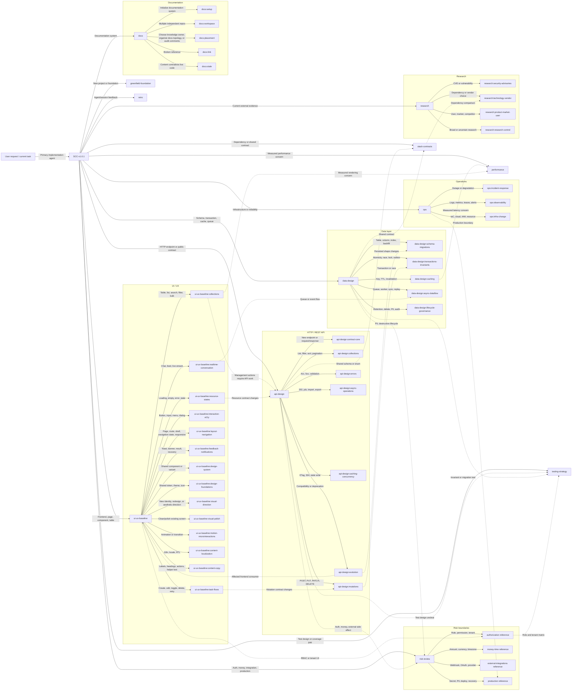

# Agent and Skill Routing Graph

Skill routing เป็น graph ไม่ใช่ strict tree: งานหนึ่งอาจ invoke หลาย family พร้อมกันเมื่อมี
work surface หรือ decision ข้าม domain. เอกสารนี้อธิบายเฉพาะ routing ของ skill;
การเลือก agent หรือ session เป็น manual decision ของผู้ใช้และอยู่นอก graph นี้.
เส้นทึบคือ primary/parent routing; เส้นประคือ cross-domain trigger ที่อาจโหลดร่วมกัน.
`ui-ux-baseline` เป็น generic quality baseline และ quality lens กลางของงาน UI/UX/frontend; คำขอด้าน
usability, accessibility, information hierarchy, content clarity, responsive behavior และ visual consistency เป็น routing
signal ของ router นี้. งานที่ขอ aesthetic direction หรือทำให้หน้าปัจจุบันสวยขึ้นแบบเปิดกว้างไป
`visual-direction`; งาน clean/polish ที่คง direction เดิมไป `visual-polish`. Child edges ด้านล่างเป็น
skill on-demand ที่เป็น owner ของ procedure เฉพาะเรื่อง.



## Trigger model

คำขอเข้าที่ SCC primary ก่อนเสมอ จากนั้น SCC จึงจำแนก trigger และ route ไป skill ที่เกี่ยวข้อง:

1. **Surface trigger** — งานกำลังแตะ UI, API, data, operations หรือ documentation surface ใด
2. **Decision trigger** — มี decision เฉพาะด้าน เช่น pagination, mutation, migration หรือ permission หรือไม่
3. **Risk trigger** — งานข้าม auth/tenant, money, production, external หรือ irreversible boundary หรือไม่

Skill family ไม่ได้ถูก invoke จาก keyword อย่างเดียว. ตัวอย่าง `RBAC` ใน prose ที่แก้ typo ไม่ควร
invoke `risk-review`; แต่การออกแบบหรือเปลี่ยน role/permission behavior ต้อง invoke authorization reference.

## Verification

```bash
python3 test/config/verify-skill-routing-graph.py --self-test
```

Validator ตรวจว่า skill ทุกตัวมี node เดียว, top-level skill ถูก route จาก `SCC`, nested skill มี
parent-child edge และถูกกล่าวถึงใน parent router, graph edge ทุกเส้นชี้ node ที่ประกาศแล้ว และ relative
reference ใน `SKILL.md` มีปลายทางจริง. `--self-test` จะตัด skill edge และ `SCC → ACV` ชั่วคราว
แล้วยืนยันว่า validator fail ตามที่คาด. Cross-domain semantics และ trigger recognition ยังต้องพิสูจน์ด้วย
`test/routing/run.sh` แยกต่างหาก.
